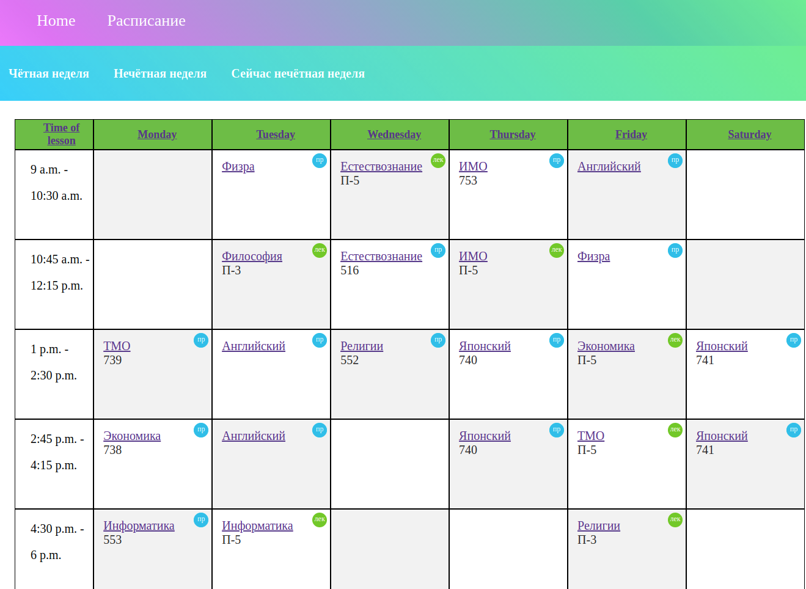
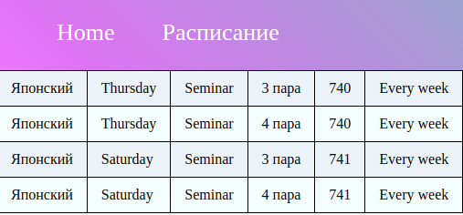

# Schedule
- stack `python Django`, фронтэнд с использованием шаблонизатора Django

- Можно смотреть расписание для чётной недели и нечётной
- 

- Можно нажать на определённый предмет и увидеть расписание только для него

